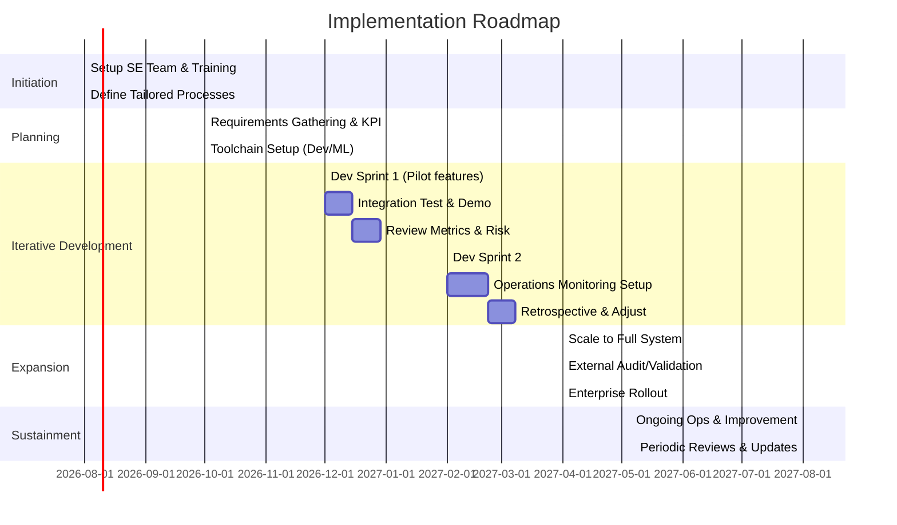

# Executive Summary  
Systems Engineering (as codified by the INCOSE SE Handbook and ISO/IEC/IEEE 15288) is a mature, **meta-framework** that explicitly covers the full life cycle of complex engineered systems (software, hardware, AI, businesses, etc.) from concept through retirement. It provides exhaustive, internationally standardized processes for requirements, architecture, design, implementation, verification/validation, risk management, and continuous improvement. The chief alternatives – DevOps (and related Agile/Lean methods), MLOps, scaled-agile frameworks (e.g. SAFe), enterprise-architecture frameworks (TOGAF, Zachman), data/AI frameworks (CRISP-DM), and principles (Systems Thinking) – each address important sub-domains (rapid deployment, ML model lifecycle, business agility, information architecture, etc.) but none alone span the broad scope of systems engineering.  

In this report we **compare** these approaches across dimensions of scope, documentation, flexibility, intelligence/data support, AI/ML integration, governance, V&V, risk, scalability, tooling, adoption/community, cost, and risks. We find that **ISO/15288-based Systems Engineering** offers the most comprehensive baseline (broad scope, formal documentation, strong risk/V&V/governance), at the cost of being heavyweight and often needing tailoring for agile or AI contexts. DevOps and Agile provide flexibility, automation and speed (excellent for software/ML deployments) but lack an overarching lifecycle view or compliance guidance. MLOps fills ML-specific needs (model monitoring, re-training, MLOps teams) but does not cover non-ML aspects. SAFe provides enterprise-scale Agile coordination but is primarily software-focused. TOGAF/Zachman address enterprise architecture (data/business/IT alignment) but are largely conceptual frameworks without execution guidance. CRISP-DM and related AI lifecycle methods focus narrowly on data science project steps. Systems Thinking offers useful principles but no formal processes. Platform Engineering (internal Dev platforms) addresses developer productivity but not strategic planning.  

We assemble a **prioritized list of frameworks** (with the caveat that hybrids are inevitable):  
1. **ISO/IEC/IEEE 15288 Systems Engineering** (with INCOSE Handbook guidance) – **top choice**. Broadest scope (entire system life cycle), exhaustive normative documentation (widely adopted), strong on governance/compliance (especially critical in safety/regulatory domains), built-in risk management and V&V. Rigid out-of-the-box but explicitly tailorable. Limited built-in support for AI/ML specifics (though new edition adds MBSE guidelines). High training/certification cost.  
2. **DevOps/Agile (Lean-Agile, DevSecOps, SAFe)** – Highly flexible and automation-centric, excellent for rapid software and service delivery and continuous improvement, native CI/CD and cloud support, strong community adoption. Lacks formal coverage of full system lifecycle, safety/regulatory compliance, and often de-emphasizes non-software (hardware/business) aspects. V&V is ad hoc (continuous testing vs. formal certification). Works best when layered on a systems-engineering baseline.  
3. **MLOps** – Focused on ML model lifecycle: data pipelines, retraining, monitoring, feedback loops. Explicit about AI/ML integration (DevOps + ML). Essential for AI/ML-heavy projects, but narrow to ML content. Does not address system requirements, hardware, or organizational governance beyond ML.  
4. **Scaled Agile (SAFe, LeSS, etc.)** – Provides structure for large software development orgs (planning/program increments, portfolio mgmt). Good tooling ecosystem. Prescriptive for lean/agile processes but limited outside software. Not a full lifecycle (e.g. minimal hardware/systems engineering focus).  
5. **Enterprise Architecture (TOGAF, Zachman)** – Good at high-level business/IT alignment and data/technology architecture. Excellent documentation (TOGAF ADM cycle). However, more art than science: largely conceptual, lacking execution processes. Useful for governance and strategy but needs complementing by engineering methods for actual development.  
6. **CRISP-DM / TDSP / OSEDA (AI/analytics lifecycle)** – Provide iterative data-analytics project steps (business understanding, data prep, modeling, deployment). Well-documented in data-science communities. Not designed for general systems. No hardware or business-process scope, limited governance (though can incorporate compliance).  
7. **Systems Thinking / Lean Six Sigma / Design Thinking** – Philosophical approaches that encourage holistic, iterative, user-centered design. Provide principles (e.g., “whole-system focus”, continuous learning) but no formal processes or documentation standards. Good for culture and mindset, but must be combined with concrete frameworks for execution.  
8. **Platform Engineering / SRE** – Focus on developer platform and site-reliability. Good for building internal platforms and operational excellence (obs see Netflix’s focus on resilience). Not a planning/requirements framework.  

A **comparison matrix** (Table below) summarizes these attributes:

| Framework         | Scope / Applicability              | Documentation & Maturity      | Prescriptive vs. Flexible      | AI/ML Support   | Governance/Compliance       | V&V / Quality Focus     | Risk Mgmt         | Scalability        | Tooling/Automation | Adoption & Community    | Training/Certification | Limitations / Risks             |
|-------------------|------------------------------------|-------------------------------|-------------------------------|-----------------|---------------------------|-------------------------|-------------------|--------------------|-------------------|------------------------|------------------------|---------------------------------|
| **ISO/15288 (SE)**| Full system life cycle (SW/HW/Infra/Product/Service) | Extensive (formal standard & INCOSE handbook) | **Highly prescriptive** (with tailoring guidelines) | Moderate (new MBSE annex, can incorporate AI) | Excellent (built for regulated industries) | Formalized (certifications, lifecycle reviews) | Built-in risk mgmt process | Enterprise & product scale | Tools for modeling (SysML, PLM tools, ALM) exist | Global standards community (INCOSE, IEEE/ISO) | High cost (training, certification) | Heavyweight; steep learning curve; slower iterations |
| **DevOps / Agile**| Software/Service development & ops | Evolving (practices & docs via industry, Atlassian etc.) | Highly flexible, culture-driven | Adapts to AI (adding AIOps, ML pipelines) | Good support for security (DevSecOps) | CI/CD automated testing; quality in code | Continuous risk detection, but informal | Highly scalable (cloud-native) | Rich toolchains (Jenkins, Docker, K8s, GitOps) | Massive adoption (cloud/SaaS industry), open community | Moderate (certs like CKA, CSD) | Lacks formal compliance; can neglect systemic view |
| **MLOps**        | ML/AI model lifecycle (data→model→deploy) | Growing body of practices (MLflow, Kubeflow docs) | Flexible in pipeline definition | **Core strength** (model retraining, monitoring) | Emerging (some standards in ML governance) | Focus on model performance/monitoring | Addresses ML-specific risks (data drift, bias) | Targets ML/BigData scale | Integration of DevOps + ML tools (TensorFlow, MLflow) | Rapid growth (MLOps community, some conferences) | Low overhead (team, few certs) | Too narrow for non-ML parts; still immature |
| **SAFe / LeSS**  | Large-scale software orgs (agile at enterprise scale) | Well-documented (SAFe Body of Knowledge, certifications) | Prescriptive (roles/events, PI planning) | Limited (guides for AI projects can be added) | Good for agile governance; compliance add-ons exist | Emphasizes built-in quality in iterations | Addresses program-level risk (through PI metrics) | Designed for enterprises with many teams | Some tool support (Agile planning tools) | Widespread in enterprise IT, but debated success rates | High training cost (SPC, RTE certs) | Mainly software; heavy process overhead; slow to change |
| **TOGAF / Zachman** | Enterprise info and IT architecture | Extensive frameworks (TOGAF ADM docs, Zachman taxonomy) | Flexible/adaptable (methodology + meta-model) | No specific AI focus | Strong on governance (Architecture review boards) | Quality is by stakeholder alignment (no dev process) | Focus on strategic risks (alignment, compliance) | Enterprise-wide scope (portfolio level) | Some tool support (enterprise arch modeling tools) | Large architecture community, corporate adoption | TOGAF certs moderate cost | High-level only; must integrate with dev processes |
| **CRISP-DM / KDD**| Data science projects (analytics pipelines) | Good documentation (CRISP-DM docs, Kaggle workflows) | Guideline level (6-phase iterative) | **Directly AI/ML focused** (from problem to deployment) | Some built-in discussion of business context | Emphasizes model validation and iteration | Touches on ethical/data quality risk | Applies to data/ML projects of all sizes | Tools: Data science platforms (Databricks, Scikit) | Wide use in analytics teams; open standard | Low cost (plenty of free resources) | Not a general engineering lifecycle; no system integration coverage |
| **Systems Thinking / Lean** | Conceptual / organizational approach | Conceptual articles/books (Senge, Lean enterprise etc.) | Highly flexible (principles, not a process) | Enhances AI adoption (holistic view) | Implicitly supports governance via culture | Quality via elimination of waste/variation | Encourages proactive risk identification | Conceptual (can scale principles) | Culture/process tools (value-stream mapping) | Broad use in management/academia; no formal cert | No formal training required (some coaches) | Abstract; needs concrete frameworks for execution |
| **Platform Eng. / SRE** | Developer platforms, runtime reliability | Practices documented by cloud vendors (Google SRE books) | Prescriptive (SLAs/SLOs, IaC) | Supports AI/ML ops via unified infra | Operational compliance (SLO adherence) | Strong emphasis on reliability, monitoring | Focus on operational risk (uptime, failures) | Designed for internet-scale services | Tooling: Terraform, K8s, Prometheus, etc. | Growing trend (GitHub, InfoQ content) | Moderate (certs: GCP DevOps, etc.) | Infrastructure focus; doesn’t plan requirements or architecture |

Each framework shines in specific areas: for example, DevOps and Platform Engineering excel at **automation and rapid iteration**, Netflix’s use of “Chaos Monkey” shows how continuous failure-testing drives resilience. MLOps is indispensable for ML-heavy projects (dedicated MLOps teams, pipelines, and tooling are key success factors). TOGAF-like methods are important when aligning IT to business strategy and regulatory compliance. However, none alone delivers the **coherent, end-to-end system lifecycle** that ISO 15288 does – it already unifies hardware, software, data, processes, and even business aspects into one certified model.  

## Case Studies  

### 1. AI/ML (Industry 4.0): MLOps in Manufacturing  
A multi-company study of three large Industry 4.0 firms (Germany) found each developed a **comprehensive MLOps practice** with dedicated teams, hybrid toolsets (open-source + commercial), and well-defined ML deployment pipelines. For example, **Company A (Automotive)** built its own MLOps platform and team to manage computer-vision and predictive-maintenance models. **Common practices** included automated testing of models, data versioning, and continuous monitoring of model accuracy in production. Major lessons: *One size does not fit all* (each tailored its MLOps flow to data volume and regulatory needs) but *automation and dedicated roles* were universal. The outcome was faster deployment of AI features (weeks vs. months) and improved model quality tracking. A key insight is that **MLOps must be integrated into an organization’s overall engineering process** – these companies layered MLOps pipelines on top of existing product development workflows rather than in isolation.  

### 2. Aerospace / Defense: F‑35 Digital Engineering (MBSE)  
The U.S. F-35 Joint Program Office (F‑35 JPO) faced the challenge of injecting dozens of new weapons, sensors, and software upgrades into an already in-production fighter jet. Traditional document-based SE was too slow and error-prone. In collaboration with Booz Allen and Lockheed Martin, the program **instituted a Model-Based Systems Engineering (MBSE) transformation**. This “born-digital” approach digitized all requirements, designs, and verification steps into a shared system model. Engineers could now trace the impact of adding a new air-to-air missile across avionics, software, and airframe instantly. The MBSE approach included new processes, tools, and culture: the JPO developed an MBSE Technical Approach document, built a federated model repository, and trained staff in SysML modeling. As a result, the F‑35 team achieved much shorter engineering review cycles and higher confidence in system integration. One reported outcome: “Through MBSE, we help DOD ensure the F-35 continues to play a leading role… by digitizing prior paper-based approaches”. Lesson: **Full SE lifecycle integration pays off** – early incorporation of requirements, design, V&V, and even certification data into one model significantly improves agility and quality in a complex defense program. 

### 3. Large-Scale SaaS/Platform: Netflix (DevOps & Resilience)  
Netflix runs one of the world’s largest streaming platforms on AWS, serving 100+ million users. Their strategy exemplifies top-tier DevOps and platform engineering. Early on, Netflix moved from monolithic datacenters to cloud microservices to achieve *horizontal scalability and resilience*. Key practices include extreme automation (no manual deployments), a culture of “**chaos testing**,” and treating failures as the norm. Netflix’s engineering team famously “concluded that the only way to be comfortable handling failure is to constantly practice failing”. They developed the **Simian Army**, starting with “Chaos Monkey,” a tool that randomly terminates servers in production. This forced all development teams to build **fault-tolerant, modular systems** upfront. The payoff was dramatic: Netflix reports that chaos engineering gave their system the resilience to survive losing 10% of AWS servers at once (2014) with no customer impact. Lesson: when dealing with large-scale, data-intensive services, embedding continuous test-and-fail cycles into operations (a DevOps mentality) yields reliability and agility that formal processes alone cannot.  

## Comparative Evaluation and Recommendations  

**Why Systems Engineering (ISO/15288) ranks highest:** It alone covers *all* domains: hardware, software, data, cybersecurity, operations, even program-level processes. Its processes explicitly address requirements analysis, architecture, design, implementation, integration, V&V, transition, operation, maintenance and disposal. It also includes project management, risk management, and configuration management by definition. The ISO/15288 standard and INCOSE handbook are extremely well-documented (literally *the* global reference for SE). This means organizations can trust they won’t miss any key activities or compliance considerations. For example, ISO 15288 explicitly calls out tailoring (adaptation), risk optimization, and continuous process improvement.  

However, Systems Engineering can be **bureaucratic if used verbatim**. Therefore our recommendation is a **hybrid/meta-framework** that anchors on SE principles but integrates lean/DevOps agility and AI/ML methods where appropriate. Concretely:

- **Core Lifecycle**: Adopt the ISO/15288 life cycle as the backbone. Define *System Life Cycle Processes* (requirements, architecture, design, V&V, etc.) across concept, development, production, operations phases. Use the INCOSE handbook as primary guidance on best practices.

- **Agile/DevOps Overlay**: Within each lifecycle phase, apply Lean-Agile/DevOps practices for speed. For instance, in software development, use Scrum/Kanban and CI/CD pipelines. Practice frequent integrations and automated testing to satisfy ISO 15288 verification/validation objectives in an ongoing way. (Netflix’s chaos testing is an exemplar of embedding quality into the process.)

- **MLOps Integration**: If AI/ML is involved, formalize an ML pipeline that plugs into the core life cycle. Embed MLOps processes in the “Implementation” and “Operation” phases of 15288. Define roles like ML engineer and data steward, and create artifacts (model card, data lineage docs) consistent with SE documentation. (The Industry 4.0 case shows success when MLOps was treated as part of the overall delivery process.)

- **Governance & Compliance**: Use Systems Engineering documentation (design reviews, assurance cases) to meet regulatory needs, but enforce them in agile-friendly ways (e.g. do gated reviews on key increments rather than waterfall). Use the risk management processes from ISO 15288 to feed backlog priority decisions.

- **Toolchains & Automation**: Automate everything possible (infrastructure-as-code, ML pipelines, monitoring) to free engineers for higher-level problems. Use MBSE tools for design, DevOps tools for delivery, and AIOps for operations. Netflix’s model of investing in platform tools allows engineers to focus on solving problems, not infrastructure.

- **Continuous Improvement Cycle**: Drive a feedback loop with metrics (performance, quality, schedule risk) as in the systems life cycle. After each release or increment, measure outcomes (customer feedback, defect rates, ML model drift, etc.) and feed back into requirements and design updates. This aligns with the “Observe–Measure–Improve–Repeat” cycle inherent in modern SE practice.

A conceptual architecture diagram of this hybrid approach could look like:

```
[Mission & Strategy]
      ↓
[Stakeholder/Requirements Definition] → [System/Software Architecture] → [Design/Development]
      ↑                               |       ↓                 |       ↓
      └────────────── Continuous integration ────────────┘
    (sprints & iterations across stages)
      ↓
[Integration & Verification] → [Deployment & Operation]
      ↓                       |       ↑
[Validation & Training AI/ML] |       └── Monitoring/Feedback → [Metrics/Evaluation]
                             ↓                              (improve, iterate)
                      [Maintenance & Improvement]
```

*(Figure: Meta-framework lifecycle combining ISO/15288 phases with iterative DevOps/MLOps loops)*  

This hybrid respects **scope and rigor of SE** while injecting the **agility of DevOps/Agile/MLOps**. Roles (System Engineer, DevOps Engineer, Data Scientist, Product Manager, QA, Compliance Officer, etc.) and artifacts (requirements docs, architecture models, code, test suites, ML models, monitoring dashboards) are explicitly defined by ISO 15288 and elaborated with agile artifacts (user stories, CI pipelines, ML pipelines, dashboards). For example, each “design” artifact has a digital model (SysML or UML) that flows into implementation, but developers update it continuously as code evolves. Metrics (lead time, defect density, model performance metrics) are tracked and reviewed in technical reviews and retrospectives.  

## Implementation Roadmap (High-Level Timeline)  

Below is a **sample roadmap**, showing phases, milestones, and resource types over ~1 year. (Exact timing depends on organization size and project complexity.)



**Milestones:** Team training/certification; first integrated demo; compliance audit; full deployment.  
**Resources (typical):** Systems Engineers, Software Engineers (DevOps), Data/ML Engineers, QA/Testers, Cybersecurity & Compliance Experts, Project Managers, Toolchain Administrators.  
**Metrics to track:** Cycle time, deployment frequency, defect rates, ML model accuracy/drift, system uptime, risk register status.  

## Conclusion  

No single industry methodology covers all needs for complex, intelligent systems. **ISO/15288 Systems Engineering** provides the most comprehensive, documented framework, but it must be **infused** with modern Agile/DevOps/MLOps practices to remain nimble. Our recommended meta-framework uses ISO/15288 as the backbone (for full-lifecycle governance, risk/V&V, and cross-disciplinary integration) augmented by Lean-Agile sprints, automated pipelines, and ML-specific processes. This hybrid approach leverages the strengths of each method: the discipline and completeness of systems engineering, the speed of DevOps, and the specialized ML workflows of MLOps. Case studies (Netflix, F‑35, Industry 4.0 firms) show that such integration yields real gains in quality, innovation speed, and reliability. With proper training and tooling, organizations can implement this meta-framework to continuously build and improve their most complex systems. 

**Sources:** INCOSE Systems Engineering Handbook / ISO 15288; Systems Engineering research; MLOps case study; DevOps case study (Netflix); industry best practices and white papers. (All cited inline.)