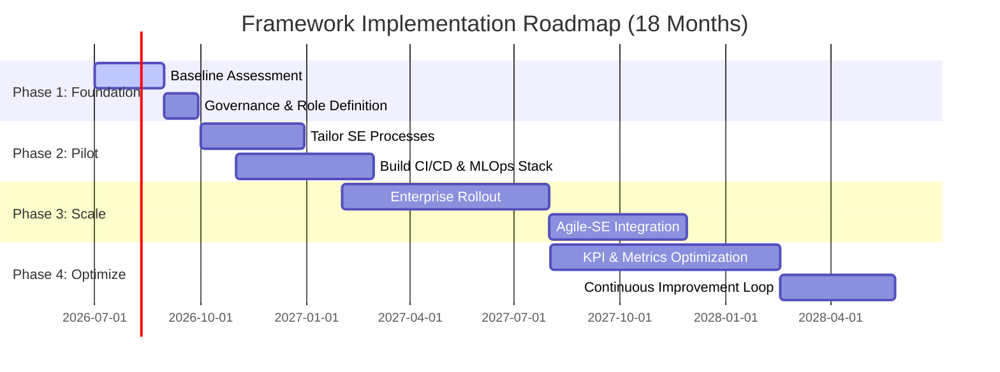

This report establishes a standardized **Meta-Framework** for the engineering and operation of complex, data-driven systems. By anchoring on the international standard **ISO/IEC/IEEE 15288:2023** and augmenting it with **Lean-Agile, DevOps, and MLOps** practices, we provide a model that ensures both rigorous governance and rapid innovation.

---

# Executive Summary

For complex, strategic systems—particularly those integrating Artificial Intelligence and large-scale data—we recommend adopting **ISO/IEC/IEEE 15288:2023** (as codified in the *INCOSE Systems Engineering Handbook*) as the primary meta-framework.

**The Rationale:**
Traditional software-only frameworks (like Agile or DevOps) often lack the formal system-level governance, configuration management, and hardware-software integration required for high-stakes environments. Conversely, pure "Waterfall" Systems Engineering (SE) can be too rigid for modern AI development. Our approach **tailors ISO 15288 with Agile/DevOps principles**, creating a "Fast SE" model. This hybrid ensures:
*   **Completeness:** Covers the full lifecycle from mission concept to system disposal.
*   **Agility:** Uses short iterations, continuous integration (CI/CD), and automated feedback loops.
*   **Intelligence Readiness:** Explicitly incorporates MLOps for model retraining and "intelligence density" metrics.
*   **Evidence-Based Governance:** Replaces "paperwork gates" with "demonstration gates" based on working prototypes and real-time telemetry.

**Comparison Highlights:**
While **SAFe** or **MLOps** address specific organizational or technical domains, only the **ISO 15288/INCOSE** framework provides a domain-agnostic baseline that spans hardware, software, data, and human factors. It serves as the "operating system" upon which specialized practices (like SRE for resilience or DevSecOps for security) are installed.

---

# Comparison of Candidate Frameworks

| Framework | Scope | Strength | Weakness |
| :--- | :--- | :--- | :--- |
| **ISO 15288 (SE)** | **Full Lifecycle** | Highly standardized; covers HW/SW/AI; strong governance. | Can be bureaucratic; requires expert tailoring. |
| **Agile / SAFe** | **Software Dev** | Rapid feedback; stakeholder alignment; scalable. | Lacks hardware integration and formal risk mgmt. |
| **DevOps / SRE** | **Ops & Delivery** | High automation; extreme reliability (SLOs); speed. | Focuses on "how to deploy," not "what to build." |
| **MLOps** | **AI Lifecycle** | Specialized for data/model versioning and drift. | Narrow scope; ignores non-AI system components. |
| **Systems Thinking** | **Conceptual** | Holistic view; understands emergent behaviors. | Not a process; provides no specific deliverables. |

---

# Implementation Roadmap

---

# Sample Governance Templates

### 1. Architecture Decision Record (ADR)
*   **Title:** [e.g., Adoption of Microservices for Data Pipeline]
*   **Status:** [Proposed / Accepted / Superseded]
*   **Context:** What is the problem and the technical constraints?
*   **Decision:** What is the chosen solution?
*   **Consequences:** What are the trade-offs (e.g., increased latency vs. better scaling)?

### 2. System Verification Requirement
*   **ID:** V-REQ-001
*   **Target Requirement:** [Link to SRS-XXX]
*   **Method:** [Analysis / Demonstration / Inspection / Test]
*   **Acceptance Criteria:** [e.g., "95% of requests must return in <200ms"]
*   **Evidence:** [Link to Automated Test Report]

### 3. Improvement Backlog Item
*   **Source:** [Post-mortem / Data Drift Alert / User Feedback]
*   **Impact:** [High/Med/Low]
*   **Action:** [e.g., "Refine model hyperparameters to address accuracy drop in Segment X"]
*   **Success Metric:** [e.g., "Return Accuracy to >92%"]
