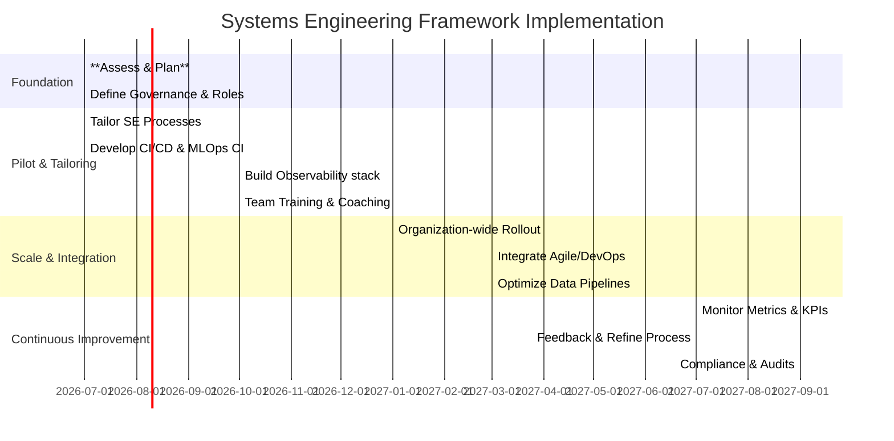

# Executive Summary

For complex, data‐driven systems we recommend adopting **ISO/IEC/IEEE 15288:2023** (as captured in the INCOSE Systems Engineering Handbook) as the primary meta‐framework, *augmented* with agile/DevOps principles. ISO/15288 provides a *comprehensive* life‐cycle model for any engineered system (from concept through disposal). It defines all key processes (requirements, architecture, design, implementation, verification, etc.) in a domain‐agnostic way, ensuring traceability, risk/configuration management and compliance. Because it is internationally recognized (by ISO, IEEE, DoD and industry), adopting ISO/15288 gives a standardized foundation across hardware, software, AI, cloud, aerospace and enterprise projects.

However, pure “waterfall” SE can be heavyweight. We therefore **tailor ISO/15288 with agile and DevOps practices**. NDIA and INCOSE guidance show that integrating Lean-Agile with 15288 yields major benefits – faster feedback, earlier value delivery, and better adaptability while retaining discipline. For example, one DoD study lists benefits such as *“improved responsiveness”* and *“early and regular demonstration of value”* when 15288 technical processes are applied iteratively. The INCOSE Agile SE models and the Lockheed Martin case study confirm that agile SE can coexist with formal life-cycle planning. In practice this means using short development iterations, continuous integration/deployment pipelines, DevSecOps toolchains, and frequent demos **within** the overall SE process.

We considered alternatives: Agile/SAFe by itself lacks formal system‐level governance and config management; DevOps/MLOps focus mainly on software or ML pipelines; SRE ensures resilience but is only operational. Systems Thinking, OODA and Cynefin are valuable *mindsets*, but not full life‐cycle processes. In comparison, **an SE‐based framework** (ISO 15288/INCOSE) can encompass all domains (hardware, software, data, AI) and explicitly define how and when to layer in agile, DevOps, CI/CD, observability, etc.

Our recommended hybrid process spans these phases (illustrated below) and includes roles and artifacts at each step. Key additions for data/AI systems are model/data pipelines, feedback loops, and metrics for “intelligence density,” throughput, and resilience. Governance (e.g. SE plans, architecture reviews, risk management) is retained at major decision gates, but each gate requires evidence from working prototypes or metrics (not just paperwork). Metrics/KPIs from software engineering (e.g. cycle time, deployment frequency) and SRE (SLIs/SLOs, error rates) will be tracked to drive continuous improvement. In sum, the chosen framework is **SE (ISO/15288 + INCOSE Handbook)** supplemented by lean-agile and DevOps methods, because it is **complete, evidence-based, and adaptable**. It yields high intelligence throughput and resilience by combining rigorous engineering discipline with fast learning cycles.

---

## Comparison of Candidate Frameworks

| **Framework**            | **Purpose/Scope**                           | **Key Benefits**                                              | **Limitations**                                               |
|--------------------------|---------------------------------------------|--------------------------------------------------------------|---------------------------------------------------------------|
| **ISO/IEC/IEEE 15288 (INCOSE)** | Full system life-cycle processes (all domains) | - **Comprehensive:** Covers requirements, design, verification, etc. - **Standardized:** Widely accepted by industry/DoD - **Governance built-in:** Risk/configuration management, process tailoring. | - **Heavyweight:** Can entail extensive documentation and overhead. - **Slower to adapt:** Out-of-box it assumes gated development (needs tailoring for agile speed). - **Learning curve:** Requires skilled systems engineers to apply properly. |
| **Agile/SAFe**           | Agile development (team-level / scaled)     | - **Iterative & Adaptive:** Fast feedback, continuous value delivery - **Collaborative:** Frequent demos align stakeholders. - **Scalable (SAFe):** Provides structure for large multi-team projects. | - **Software-centric:** Less guidance for hardware/system integration unless extended. - **Documentation:** Agile may underemphasize formal SE artifacts (e.g. detailed architecture docs). - **Scope gaps:** Portfolio and enterprise governance require add-ons (Agile SE adds focus but lacks portfolio mgmt). |
| **DevOps/DevSecOps**     | Integration of development & operations (software focus) | - **Automation:** CI/CD pipelines for rapid build/deploy cycles - **Continuous delivery:** Reduces handoffs and manual errors. - **Stability & Security:** Emphasizes testing and security earlier. | - **Narrow scope:** Addresses mostly software development and IT operations, not full system engineering. - **Culture shift needed:** Requires dev/ops collaboration and tool investment. - **Less on design:** No explicit guidance on system architecture or requirements. |
| **MLOps**                | ML model lifecycle & data operations        | - **ML specialization:** Automates data pipelines, training, and retraining of models - **Scalability:** Handles large data and model versioning (feature stores, registries) - **Collaboration:** Bridges data science and engineering teams. | - **Component-specific:** Only covers the ML/AI parts of the system. - **Complex tooling:** Involves many specialized tools (dataset versioning, model serving). - **Data challenges:** Requires robust data quality management; model drift is still hard to eliminate. |
| **Site Reliability Engineering (SRE)** | Ensuring system/service reliability and resilience | - **Reliability focus:** Uses SLIs/SLOs (e.g., latency, errors, saturation) to track health. - **Automation & Fault-tolerance:** Engineers build resilience into infrastructure and operations. - **Cross-team alignment:** Blends dev and ops objectives, aiming for “five‐nines” uptime. | - **Ops-centric:** Emphasizes running systems, not initial system design or requirements. - **Possible bottlenecks:** High stability goals can slow feature delivery. - **Requires maturity:** Teams must adopt monitoring culture, blameless postmortems, etc. |
| **Systems Thinking**     | Holistic view of socio-technical systems    | - **Big picture:** Helps understand interdependencies and emergent behavior. - **Stakeholder-centric:** Considers the full ecosystem (people, processes, technology). | - **Non-prescriptive:** Provides a mindset, not a concrete process or steps. - **Qualitative:** Hard to measure; outcomes depend on practitioner insight. |
| **OODA Loop**            | Rapid decision-making cycle (Observe–Orient–Decide–Act) | - **Agility:** Encourages quick learning and adaptation in dynamic environments. - **Competitive edge:** Originally for combat, useful where speed of decision matters. | - **Scope-limited:** A cognitive framework, not an engineering method. - **Lacks structure:** Doesn’t specify how to document or implement system changes. |
| **Cynefin Framework**    | Context-driven decision-making             | - **Context sensitivity:** Classifies problems as simple/complicated/complex/chaotic and suggests how to respond (e.g., probe-sense-respond in complexity). - **Strategy tool:** Helps choose management style and processes based on problem domain. | - **Conceptual:** Provides guidance on approach but not the process itself. - **Requires judgment:** Effectiveness depends on correct identification of domain. |

Each candidate has merits, but none alone meets **all** needs. Agile/DevOps/SRE excel at speed and reliability for software, and MLOps covers ML pipelines, but they lack full life‐cycle governance. ISO/15288 (with INCOSE guidance) subsumes these by defining where iterative, data-driven practices plug into each life‐cycle phase. Thus our hybrid process uses ISO/15288 as the backbone and *incorporates* Lean-Agile, DevOps, MLOps, and SRE tactics where they add value.

---

## Implementation Roadmap (Gantt Chart)

This roadmap outlines an ~18‐month plan: start with assessing current processes and establishing a governance structure. In Phase 2, *pilot* tailored processes and build the engineering toolchain (CI/CD, MLOps pipelines, observability). Phase 3 scales the rollout enterprise-wide and formally integrates Agile/DevOps practices into the SE life-cycle. Finally, Phase 4 embeds *continuous improvement* – ongoing monitoring of KPIs and iterative refinement of requirements, architecture, and processes.

---

## Recommended Reading and Sources

- **ISO/IEC/IEEE 15288:2023 – _Systems and software engineering – System life cycle processes._** The official international standard defining the system life-cycle process framework.
- **INCOSE Systems Engineering Handbook, 5th Ed. (2024).** Authoritative guide aligned with ISO 15288; covers concepts, processes, and tailoring.
- **NDIA Systems Engineering Standards Committee (2015), “IEEE 15288 Meets Lean Agile.”** Discusses integration of 15288 with Agile/DevOps for defense projects.
- **Dove et al., *Case Study: Agile Systems Engineering at Lockheed Martin* (2018).** Real-world example of embedding SAFe-style agile into a large aerospace SE process.
- **Splunk Blog, “SRE Metrics: Core SRE Components & the Four Golden Signals” (2025).** Overview of Site Reliability Engineering metrics and practices.
- **Everpure (PureStorage), *What is MLOps?* (2025).** Defines MLOps practices and benefits (automation, scalability, reliability) for machine learning workflows.
- **Systems Engineering Body of Knowledge (SEBoK), “Assessing SE Performance of Enterprises.”** Guidance on SE metrics and governance (value, efficiency, quality).
- **DX.dev Engineering Guide, “Software development metrics” (2023).** Discusses key engineering metrics (throughput, quality, resilience) relevant for measuring system performance.
