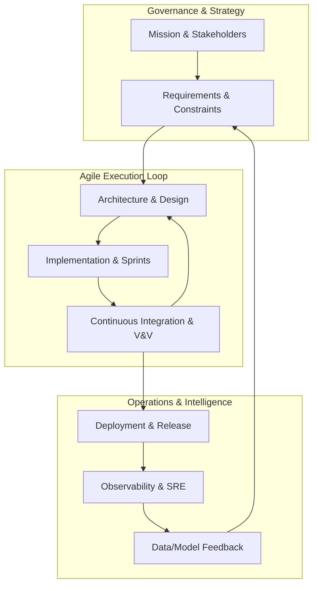

# agent.md (Meta-Framework Overview)

**Framework:** ISO/IEC/IEEE 15288 Systems Engineering (Tailored for Agile/AI)
**Purpose:** To provide a comprehensive, end-to-end lifecycle for complex systems, ensuring high **Intelligence Throughput** and **Operational Resilience**.

### 1. Core Principles
*   **Systems Thinking:** Managing the system as a holistic set of interdependencies rather than isolated components.
*   **Continuous Value Delivery:** Utilizing Agile iterations within formal SE phases to provide early and regular value.
*   **Data-Driven Decision Making:** Using SLIs/SLOs and ML performance metrics to guide architecture and requirement updates.
*   **Shift-Left Governance:** Integrating security, compliance, and verification early in the lifecycle through automation.

### 2. Lifecycle Activities & Deliverables

| Phase | Key Activities | Primary Deliverables |
| :--- | :--- | :--- |
| **Mission & Needs** | Stakeholder analysis, mission profiling, KPI definition. | Mission Statement, Business Requirements. |
| **Requirements** | Functional & non-functional elicitation, constraint mapping. | System Requirements Spec (SRS), Traceability Matrix. |
| **Architecture** | Modular design, trade studies, interface definition. | Architecture Design Document (ADD), SysML/UML Models. |
| **Implementation** | Agile Sprints, CI/CD, ML model training, IaaC. | Source Code, Trained Models, Container Images. |
| **Integration & V&V** | Automated testing, system integration, validation. | Test Reports, Verification Evidence, V&V Matrix. |
| **Ops & Sustainment** | Monitoring, SRE practices, incident management. | Dashboard/Telemetry, Incident Logs, SLO Reports. |
| **Improvement Loop** | Retrospectives, data drift analysis, backlog refinement. | Improvement Backlog, Refined Requirements. |

### 3. Roles & Responsibilities
*   **Chief Systems Engineer:** Framework owner; ensures technical integrity and cross-domain alignment.
*   **System Architect:** Defines the "Blueprints"; manages interfaces between AI, software, and infra.
*   **Product Owner:** Maintains the vision; prioritizes the backlog based on stakeholder value.
*   **DevOps/SRE Team:** Manages the "Factory" (pipelines, cloud infra, and reliability targets).
*   **Data/ML Engineers:** Manages the "Intelligence" (data quality, model training, and retraining loops).
*   **Security/Compliance Officer:** Ensures the system meets regulatory (ISO 27001, GDPR) and safety standards.

### 4. Process Flow (Iterative Loop)

